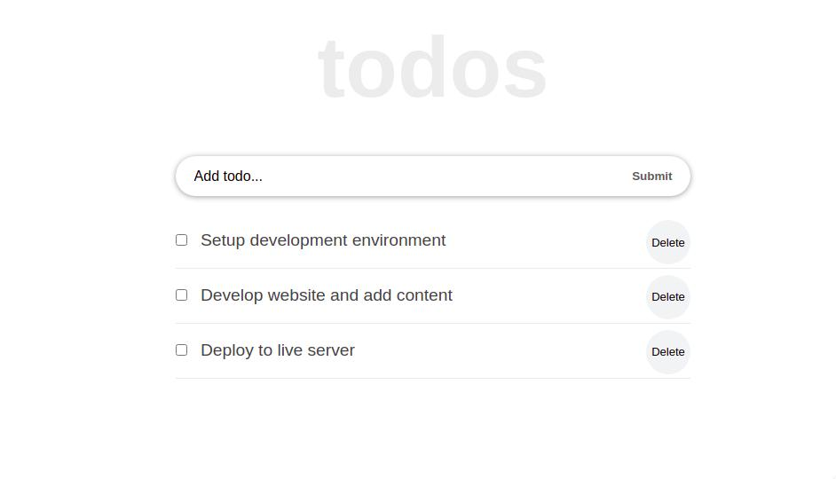

# Todo List 

> This is a todo list app witten with react. It is an app that allows the user to create a todo lists, mark them as completed, edit todo, and remove todo.



## ⚒️  Built with

- Html
- Css
- JavaScript
- React

## 🎞️ Frameworks and Technologies used

- Bootstrap
- Webpack
- HTML
- CSS
- JavaScript
- ReactJS

## 🖥️ Live Demo
- [Demo]() :point_left:

## Getting Started

To get a local copy up and running on your machine, follow these simple steps.
Enter this in your terminal 👇
```
 git@github.com:Qoosim/todoList-react.git 
```
## 🛠️ Prerequisites
```
  Install Node.js on your machine
```
## 🕹️ Setup
```
  Clone the repository on your machine and cd into it
  run npm install
  run npm run start
```
## Author

👤 **Qoosim AbdulGhaniyy**

- GitHub: [Qoosim](https://github.com/Qoosim)
- LinkedIn: [Qoosim](https://www.linkedin.com/in/qoosim)
- Twitter: [Qoosim](https://twitter.com/qoosim_ayinde)

## 🤝 Contributing

Contributions, issues, and feature requests are welcome!

Feel free to check the [issues page](../../issues/).

## Show your support

Give a ⭐️ if you like this project!

## Acknowledgments

- To those assist in understanding the concept of React

## 📝 License

This project is [MIT](./MIT.md) licensed.
